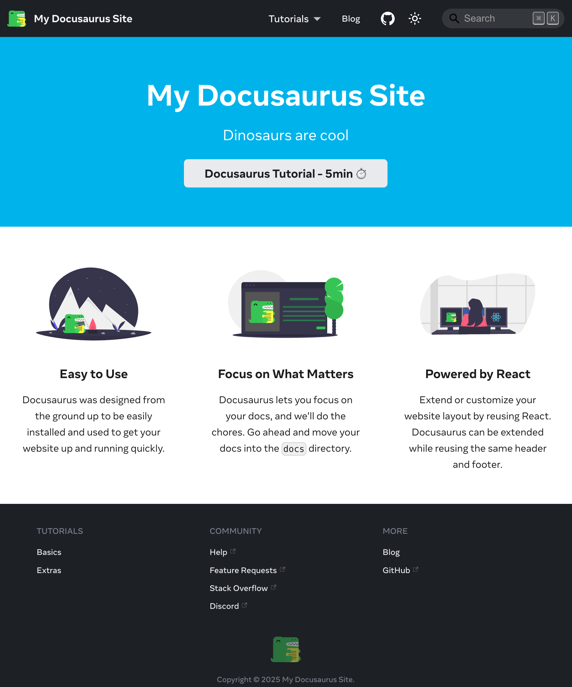

# Docusaurus Template

[](https://devenv.sh)

This repository hosts a template for [Docusaurus](https://docusaurus.io/), a modern static website generator.

It borrows heavily from the clean theme and styles of the [React Native](https://reactnative.dev/) documentation.

It uses [@easyops-cn/docusaurus-search-local](https://github.com/easyops-cn/docusaurus-search-local)
to enable offline/local search of blogs, documentation and static pages.

*It was tested on Docusaurus 3.7.0 with Node.js 24.0.2 and `pnpm` 10.11.0.*



### Installation

```
$ pnpm create docusaurus <project-name> classic --typescript --git-strategy=copy
```

And then install dependencies with:

```
$ pnpm install
```


### Local Development

```
$ pnpm start
```

This command starts a local development server and opens up a browser window.

Most changes are reflected live without having to restart the server.

Please note that local search is ***not available*** during local development.

### Build

```shell
$ pnpm build
```

This command generates static contents into the `build` directory and can be served
using any static contents hosting service.

Locally, simply run:

```shell
$ pnpm serve
```

